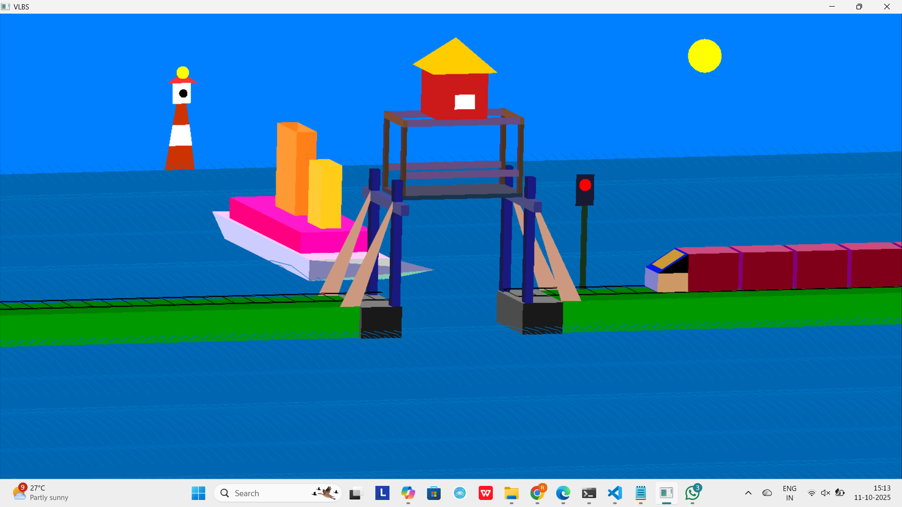
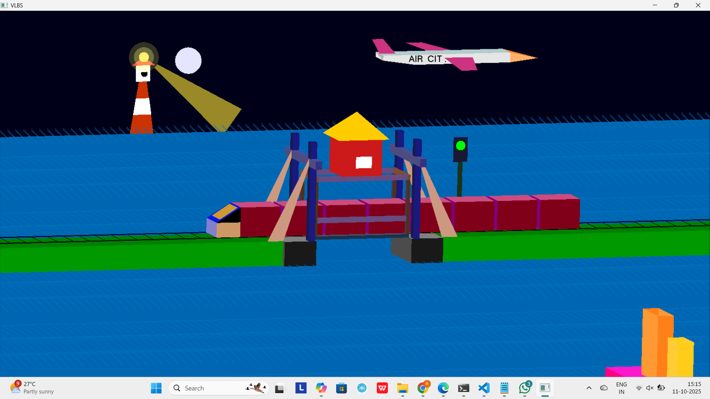

# Vertical-Lift-Bridge-Simulation

A **computer graphics mini project** that simulates a vertical lift bridge using **OpenGL and C++**.  
This simulation visually demonstrates how a vertical lift bridge operates — where the central span is raised and lowered to allow ships to pass — while showcasing the use of transformations, animations, and lighting effects in computer graphics.

---

## 📸 Preview
| Day View | Night View |
|-----------|-------------|
|  |  |

## 🧠 About the Project
* The **Vertical Lift Bridge Simulation** visually represents a realistic bridge-lifting    mechanism.  
* It was developed as a **mini project for Computer Graphics** to demonstrate:
- 3D object rendering using OpenGL primitives  
- Smooth animations using transformations  
- Day and night mode transitions using lighting effects  
- Interactive controls through keyboard input  

---

## 🚀 Features
- Animated vertical lift bridge movement  
- Realistic day and night transitions  
- Dynamic scene with water, ship, and bridge visuals  
- Smooth motion and lighting control  
- Intro screen and main simulation screen  

---

## 🕹️ Controls
| Key | Action |
|-----|---------|
| **Enter** | Switch from Intro screen (Screen 1) to Simulation screen (Screen 2) |
| **S** | Start the bridge and ship animation |
| **T** | Stop/pause the animation |
| **N** | Change to **Night View** |
| **D** | Change to **Day View** |
| **Esc** | Exit the program |

---

## 🛠️ Tech Stack
- **Language:** C++  
- **Graphics Library:** OpenGL  
- **Utilities:** GLU, freeglut  
- **Compiler:** g++  
- **IDE / Tool:** Visual Studio Code (VS Code Terminal)  
- **Platform:** Windows  

---

## ⚙️ How to Run

1️⃣ Clone the Repository : 

git clone https://github.com/Radhika242005/Vertical-Lift-Bridge-Simulation.git
cd Vertical-Lift-Bridge-Simulation

2️⃣ Compile the Program - g++ main.cpp -lfreeglut -lopengl32 -lglu32 -o bridge.exe

3️⃣ Run the Simulation - ./bridge.exe

📂 Folder Structure
Vertical-Lift-Bridge-Simulation/
├── main.cpp                # Main source code
├── bridge.exe              # Executable file (Windows)
├── README.md               # Project documentation
├── screenshots/            # Project screenshots (optional)
└── assets/ (if any)        # Textures or other resources

🌗 Screens & Modes

* Screen 1 (Intro): Title and introduction page
* Screen 2 (Simulation): Main 3D environment
* Day Mode: Bright ambient lighting and sky color
* Night Mode: Dim lights with glowing elements (like lighthouse or bridge lights)

🔮 Future Enhancements :
* Add water reflections and ripples
* Include moving vehicles or ships under the bridge
* Add sound effects (motor noise, water, etc.)
* GUI controls for lighting and speed adjustment
* Export animation as a short video

👩‍💻 Author
Radhika
🔗 GitHub: Radhika242005

